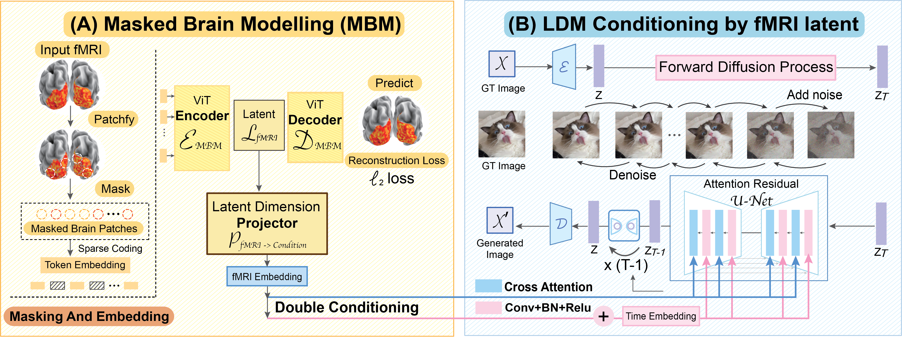

# Seeing Beyond the Brain: Masked Modeling Conditioned Diffusion Model for Human Vision Decoding
<p align="center">

</p>

## News
- May 23, 2023. Our work are featured by [The Telegraph](https://www.telegraph.co.uk/global-health/science-and-disease/ai-artificial-intelligence-brain-research/)!
- May 20, 2023. Our extension work, video reconstruction from brain activity, are released. See this [repo](https://github.com/jqin4749/MindVideo/) 
- Mar. 28, 2023. Our work are covered by NBC News! [Youtube](https://www.youtube.com/watch?v=TYbRNQ3LxwU) | [Website](https://www.nbcnews.com/tech/tech-news/brain-waves-ai-can-sketch-picturing-rcna76096)
- Mar. 1, 2023. Our paper is accpeted at CVPR2023!
- Nov. 10, 2022. Project release.

## MinD-Vis
**MinD-Vis** is a framework for decoding human visual stimuli from brain recording.
This document introduces the precesedures required for replicating the results in *Seeing Beyond the Brain: Masked Modeling Conditioned Diffusion Model for Human Vision Decoding*

## Abstract
Decoding visual stimuli from brain recordings aims to deepen our understanding of the human visual system and build a solid foundation for bridging human and computer vision through the Brain-Computer Interface. However, due to the scarcity of data annotations and the complexity of underlying brain information, it is challenging to decode images with faithful details and meaningful semantics. In this work, we present **MinD-Vis**: Sparse **M**asked Bra**in** Modeling with Double-Conditioned Latent **D**iffusion Model for Human **Vis**ion Decoding. Specifically, by boosting the information capacity of feature representations learned from a large-scale resting-state fMRI dataset, we show that our MinD-Vis can reconstruct highly plausible images with semantically matching details from brain recordings with very few paired annotations. We benchmarked our model qualitatively and quantitatively; the experimental results indicate that our method outperformed state-of-the-art in both semantic mapping (100-way semantic classification) and generation quality (FID) by **66%** and **41%** respectively. 


## Overview

Our framework consists of two main stages:
- Stage A: Sparse-Coded Masked Brain Modeling (*SC-MBM*)
- Stage B: Double-Conditioned Latent Diffusion Model (*DC-LDM*)

The **data** folder and **pretrains** folder are not included in this repository. 
Please download them from [FigShare](https://figshare.com/s/94cd778e6afafb00946e) and put them in the root directory of this repository as shown below.

File path | Description
```

/data
┣ 📂 HCP
┃   ┣ 📂 npz
┃   ┃   ┣ 📂 dummy_sub_01
┃   ┃   ┃   ┗ HCP_visual_voxel.npz
┃   ┃   ┣ 📂 dummy_sub_02
┃   ┃   ┃   ┗ ...

┣ 📂 Kamitani
┃   ┣ 📂 npz
┃   ┃   ┗ 📜 sbj_1.npz
┃   ┃   ┗ 📜 sbj_2.npz
┃   ┃   ┗ 📜 sbj_3.npz
┃   ┃   ┗ 📜 sbj_4.npz
┃   ┃   ┗ 📜 sbj_5.npz
┃   ┃   ┗ 📜 images_256.npz
┃   ┃   ┗ 📜 imagenet_class_index.json
┃   ┃   ┗ 📜 imagenet_training_label.csv
┃   ┃   ┗ 📜 imagenet_testing_label.csv

┣ 📂 BOLD5000
┃   ┣ 📂 BOLD5000_GLMsingle_ROI_betas
┃   ┃   ┣ 📂 py
┃   ┃   ┃   ┗ CSI1_GLMbetas-TYPED-FITHRF-GLMDENOISE-RR_allses_LHEarlyVis.npy
┃   ┃   ┃   ┗ ...
┃   ┃   ┃   ┗ CSIx_GLMbetas-TYPED-FITHRF-GLMDENOISE-RR_allses_xx.npy
┃   ┣ 📂 BOLD5000_Stimuli
┃   ┃   ┣ 📂 Image_Labels
┃   ┃   ┣ 📂 Scene_Stimuli
┃   ┃   ┣ 📂 Stimuli_Presentation_Lists


/pretrains
┣ 📂 ldm
┃   ┣ 📂 label2img  （ImageNet pre-trained label-conditioned LDM)
┃   ┃   ┗ 📜 config.yaml
┃   ┃   ┗ 📜 model.ckpt

┣ 📂 GOD  
┃   ┗ 📜 fmri_encoder.pth  (SC-MBM pre-trained fMRI encoder)
┃   ┗ 📜 finetuned.pth     (finetuned fMRI encoder + finetuned LDM)

┣ 📂 BOLD5000
┃   ┗ 📜 fmri_encoder.pth  (SC-MBM pre-trained fMRI encoder)
┃   ┗ 📜 finetuned.pth     (finetuned fMRI encoder + finetuned LDM)


/code
┣ 📂 sc_mbm
┃   ┗ 📜 mae_for_fmri.py
┃   ┗ 📜 trainer.py
┃   ┗ 📜 utils.py

┣ 📂 dc_ldm
┃   ┗ 📜 ldm_for_fmri.py
┃   ┗ 📜 utils.py
┃   ┣ 📂 models
┃   ┃   ┗ (adopted from LDM)
┃   ┣ 📂 modules
┃   ┃   ┗ (adopted from LDM)

┗  📜 stageA1_mbm_pretrain.py   (main script for pre-training for SC-MBM)
┗  📜 stageA2_mbm_finetune.py   (main script for tuning SC-MBM on fMRI only from test sets)
┗  📜 stageB_ldm_finetune.py    (main script for fine-tuning DC-LDM)
┗  📜 gen_eval.py               (main script for generating decoded images)

┗  📜 dataset.py                (functions for loading datasets)
┗  📜 eval_metrics.py           (functions for evaluation metrics)
┗  📜 config.py                 (configurations for the main scripts)

```


## Environment setup
Create and activate conda environment named ```mind-vis``` from our ```env.yaml```
```sh
conda env create -f env.yaml
conda activate mind-vis
```

## Download data and checkpoints
Due to size limit and license issue, the full fMRI pre-training dataset (required to replicate **Stage A**) needs to be downloaded from the [Human Connectome Projects (HCP)](https://db.humanconnectome.org/data/projects/HCP_1200) offical website. The pre-processing scripts are also included in this repo. 

We also provide checkpoints and finetuning data at [FigShare](https://figshare.com/s/94cd778e6afafb00946e) to run the finetuing and decoding directly. Due to the size limit, we only release the checkpoints for Subject 3 and CSI1 in the GOD and BOLD5000 respectively. Checkpoints for other subjects are also available upon request. After downloading, extract the ```data/``` and ```pretrains/``` to the project directory. 


## SC-MBM Pre-training on fMRI (Stage A)

The fMRI pre-training is performed with masked brain modeling in the fMRI dataset containing around 136,000 fMRI samples from 1205 subjects (HCP + GOD). To perform the pre-training from scratch with defaults parameters, run 
```sh
python code/stageA1_mbm_pretrain.py
``` 

Hyper-parameters can be changed with command line arguments,
```sh
python code/stageA1_mbm_pretrain.py --mask_ratio 0.65 --num_epoch 800 --batch_size 200
```

Or the parameters can also be changed in ```code/config.py```

Multiple-GPU (DDP) training is supported, run with 
```sh
python -m torch.distributed.launch --nproc_per_node=NUM_GPUS code/stageA1_mbm_pretrain.py
```

The pre-training results will be saved locally at ```results/fmri_pretrain``` and remotely at ```wandb```. 

After pre-training on the large-scale fMRI dataset, we need to finetune the autoencoder with fMRI data from the testing set. Run the following, 
```sh
python code/stageA2_mbm_finetune.py --dataset GOD --pretrain_mbm_path results/fmri_pretrain/RUN_FOLDER_NAME/checkpoints/checkpoint.pth
```

```--dataset``` can be either ```GOD``` or ```BOLD5000```. And ```RUN_FOLDER_NAME``` is the folder name generated for the pre-training. For example
```
python code/stageA2_mbm_finetune.py --dataset GOD --pretrain_mbm_path results/fmri_pretrain/01-08-2022-11:37:22/checkpoints/checkpoint.pth
```

The fMRI finetuning results will be saved locally at ```results/fmri_finetune``` and remotely at ```wandb```. 


## Finetune the Double-Conditional LDM with Pre-trained fMRI Encoder (Stage B)
In this stage, the cross-attention heads and pre-trained fMRI encoder will be jointly optimized with fMRI-image pairs. Decoded images will be generated in this stage. This stage can be run without downloading HCP. Only finetuning datasets and pre-trained fMRI encoder shared in our FigShare link are required. Run this stage with our provided pre-trained fMRI encoder and default parameters:
```sh
python code/stageB_ldm_finetune.py --dataset GOD
```
```--dataset``` can be either ```GOD``` or ```BOLD5000```. The results and generated samples will be saved locally at ```results/generation``` and remotely at ```wandb```.

Run with custom-pre-trained fMRI encoder and parameters:
```sh
python code/stageB_ldm_finetune.py --dataset GOD --pretrain_mbm_path results/fmri_fintune/RUN_FOLDER_NAME/checkpoints/checkpoint.pth --num_epoch 500 --batch_size 5
```


## Run fMRI Decoding and Generate Images with Trained Checkpoints
Only finetuning datasets and trained checkpoints in our FigShare link are required. Notice that images generated by the provided checkpoins gives the same evaluation reuslts as in the paper, but may not produce the exact same images as in the paper due to sampling variance. Run this stage with our provided checkpoints:
```sh
python code/gen_eval.py --dataset GOD
```

```--dataset``` can be either ```GOD``` or ```BOLD5000```. The results and generated samples will be saved locally at ```results/eval``` and remotely at ```wandb```.


## Acknowledgement
We thank [Kamitani Lab](https://github.com/KamitaniLab), [
Weizmann Vision Lab](https://github.com/WeizmannVision) and [BOLD5000 team](https://bold5000-dataset.github.io/website/) for making their raw and pre-processed data public. Our Masked Brain Modeling implementation is based on the [Masked Autoencoders](https://github.com/facebookresearch/mae) by Facebook Research. Our Conditional Latent Diffusion Model implementation is based on the [Latent Diffusion Model](https://github.com/CompVis/latent-diffusion) implementation from CompVis. We thank these authors for making their codes and checkpoints publicly available!

## Citation
```
@InProceedings{Chen_2023_CVPR,
    author    = {Chen, Zijiao and Qing, Jiaxin and Xiang, Tiange and Yue, Wan Lin and Zhou, Juan Helen},
    title     = {Seeing Beyond the Brain: Masked Modeling Conditioned Diffusion Model for Human Vision Decoding},
    booktitle = {Proceedings of the IEEE/CVF Conference on Computer Vision and Pattern Recognition (CVPR)},
    year      = {2023}
}

```
